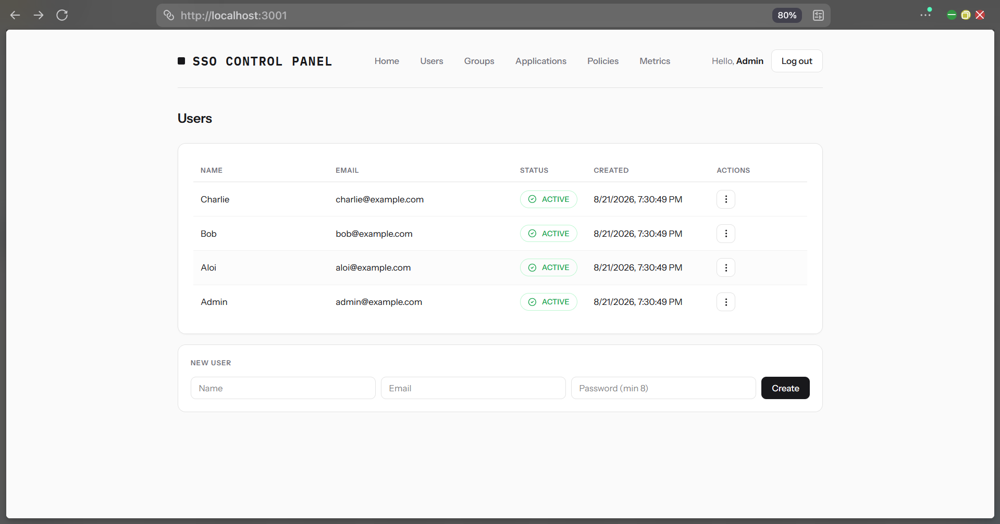
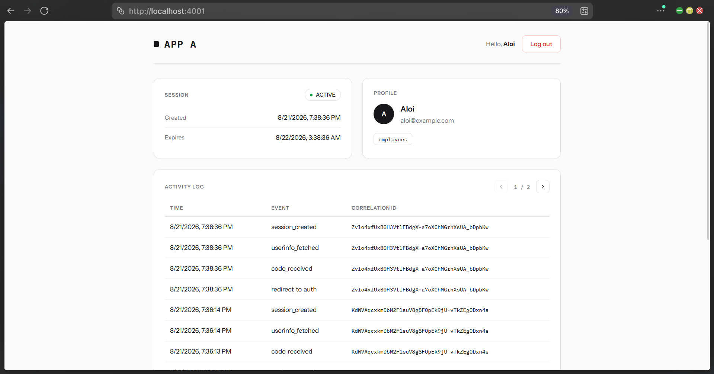
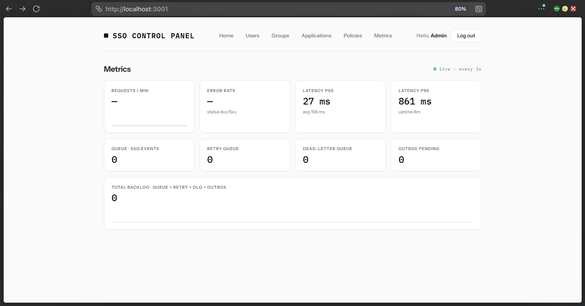
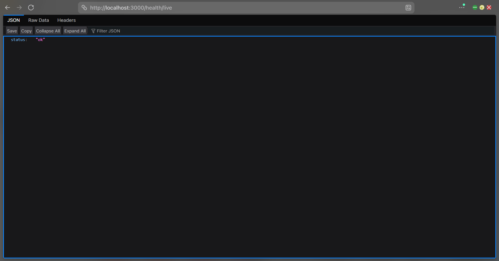
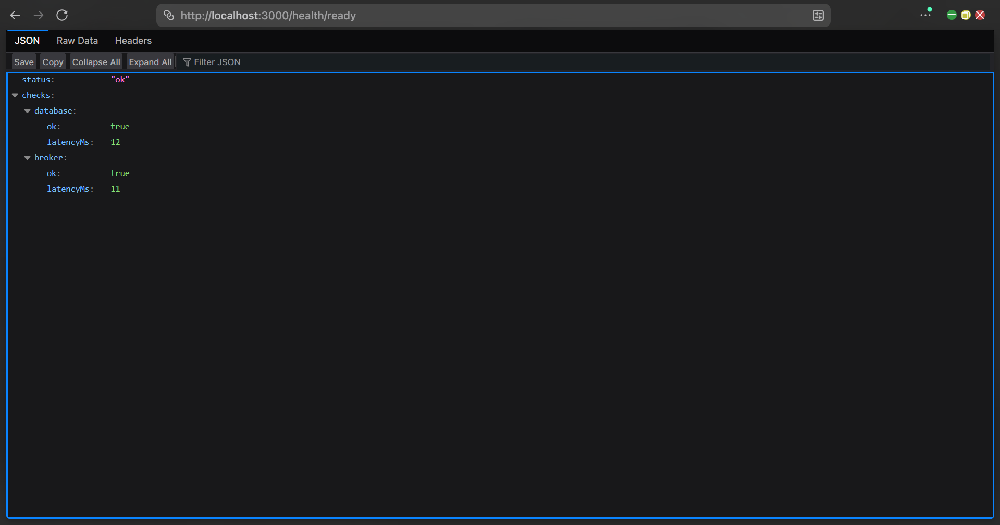

# Seleksi LabPro 2026: SSO Identity & Authorization Provider

## 1. Identitas

| | |
| :--- | :--- |
| Nama | Nathaniel Christian |
| NIM | 13524122 |

## 2. Cara Menjalankan Sistem

**Prerequisites:** Docker + Docker Compose, Node.js ≥ 22 (for migration/seed manual), pnpm (optional, for local build).

```powershell
# 1. Copy .env.example ke .env
cp .env.example .env

# 2. Build dan jalankan sistem
docker compose up -d --build
```

Cek status: `docker compose ps` (semua `healthy`).

### URL & kredensial

| Komponen | URL |
| :--- | :--- |
| Auth Provider | http://localhost:3000 |
| Control Panel admin | http://localhost:3001 |
| App A | http://localhost:4001 |
| App B | http://localhost:4002 |
| RabbitMQ | http://localhost:15672 |
| Sync worker | http://localhost:3002 |

| Peran | Email/Username | Password |
| :--- | :--- | :--- |
| Admin (control panel) | `admin@example.com` | `admin-password` |
| Demo user | `aloi@example.com` | `demo-password` |
| Demo user | `bob@example.com` | `demo-password` |
| Demo user | `charlie@example.com` | `demo-password` |
| User RabbitMQ | `sso` | `password` |

## 3. Arsitektur & Alur

Ada 8 service yang berjalan dalam docker compose:

- **Auth (SSO) provider**: `auth-server`, `control-panel`, `sync-worker`
- **Relying apps**: `app-a` & `app-b`
- **Infra**: database Auth Provider `postgres-primary`, database App A/B `postgres-local`, broker `rabbitmq`

**Alur inti:**
1. **Login SSO**: `/login` validasi akun (argon2id), untuk central session (auth_sid) dibuat.
2. **OAuth**: app generate PKCE + `state` -> redirect `/oauth/authorize` -> policy evaluation -> one-time code -> `POST /oauth/token` (PKCE verified) -> opaque access token -> `GET /userinfo` -> app buat local session sendiri.
3. **Revocation**: SSO logout / password change / user deactivate / policy change menulis event ke outbox dalam satu transaksi; worker publish ke RabbitMQ (confirm), consume, dan memanggil `/internal/logout` tiap app. Gagal -> retry dengan backoff eksponensial -> DLQ setelah maksimum percobaan. 

## 4. Keputusan Teknis

| Topik | Keputusan |
| :--- | :--- |
| Token strategy | **Opaque access token**; hash-nya disimpan di DB, bukan JWT. Bisa di-revoke kapan saja (termasuk ikut ke-revoke saat central session di-revoke). **Konsekuensi:** setiap validasi butuh 1 query DB (JWT sulit di-revoke). |
| Message broker | **RabbitMQ**; dipakai untuk routing, retry (backoff), dan DLQ. **Konsekuensi:** broker mati tidak menghilangkan event, event tetap tersimpan di outbox dan dikirim lagi setelah broker pulih. |
| Autentikasi `/internal/logout` | **HMAC-SHA256** dengan shared secret + timestamp, karena endpoint ini bukan OAuth client. **Konsekuensi:** worker dan semua app harus memegang secret yang sama; timestamp mencegah replay request lama. |
| Hapus data | **Deactivate via `status`** tanpa `deleted_at` — tidak ada DELETE; "delete" di UI mengubah status. Dipilih karena bentrok dengan unique constraint (email, policy). **Konsekuensi:** data lama tidak bisa dihapus, hanya bisa dinonaktifkan. |

## 5. Technology Stack

| Komponen | Versi |
| :--- | :--- |
| Node.js | 22 LTS (`node:22-alpine`) |
| TypeScript | 5.9 |
| pnpm | 11 |
| Fastify | 5.11 |
| React | 19 (SPA, `@fastify/static`) |
| Vite | 5.4 |
| Prisma | 7.9 |
| PostgreSQL | 16 |
| RabbitMQ | 3.13 |

## 6. Daftar Endpoint

See: [`docs/endpoints.md`](docs/endpoints.md).

Ringkasan: `POST /login`, `POST /logout`, `GET /oauth/authorize`,
`POST /oauth/token`, `GET /userinfo`, admin API `/admin/*` (users, groups,
memberships, applications, policies, metrics snapshot), app endpoints
(`/login`, `/callback`, `/api/me`, `/api/activity-log`,
`/api/processed-events`, `/api/logout`, `/internal/logout`), health probes
(`/health/live`, `/health/ready`), metrics (`/metrics`,
`/admin/metrics/snapshot`).

## 7. Bonus yang Dikerjakan

| Bonus |
| :--- |
| B02 - Observability |
| B03 - Liveness & Readiness probe | 
| B04 - Graceful shutdown | 

## 8. Screenshot

**Control panel: Users** (kelola user, status, group):



**App A setelah login SSO** (identitas, status session, activity log):



**Dashboard Metrics**: latency, error, queue depth live:



**Liveness probe**: tetap `200` saat dependency mati:



**Readiness probe** — `200` dengan checks `database` + `broker` ready:


